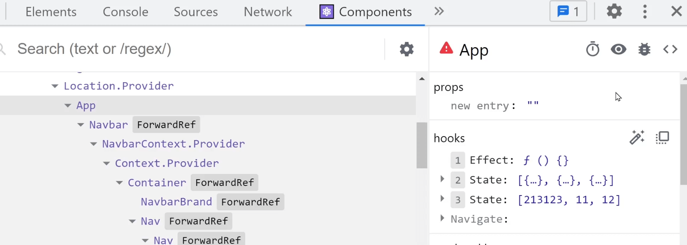

# 성능 개선

### 🗣️React 개발자 도구

### React developer tools: 크롬에서 설치 가능한 확장 프로그램



- Components 탭에서 개발중인 사이트를 component로 확인할 수 있다
- 전달되는 props값 그리고 state값 같은 내용을 확인할 수 있다


- Profiler탭에서 녹화 버튼을 누르고, 페이지를 넘기거나 버튼을 조작하는 등 과정을 거치고 녹화를 끝낸다
- 녹화된 상태에서 각 동작들의 소요시간을 확인할 수 있는데, 시간이 많이 소요된 부분을 확인할 수 있다
- ~~보통 지연은 서버에 API호출할때 생기기 때문에 FE는 잘못이 없다~~

### Redux developer tools: 크롬에서 설치 가능한 프로그램

- Redux store에 있는 state를 전부 확인할 수 있다
- dispatch가 발생할 때마다 어떻게 바뀌었는지 로그를 작성해준다

### 🦥Lazy Import

```jsx
import Detail from './routes/Detail.js'
import Cart from './routes/Cart.js'
```

- 기존에 App.js파일에서는 다음과 같이 페이지를 처음 불러올때, 필요한 모든 component를 불러오기 때문에, 첫 페이지 로딩이 약간 지연될 수 있다

```jsx
import {lazy, Suspense, useEffect, useState} from 'react'

const Detail = lazy( () => import('./routes/Detail.js') )
const Cart = lazy( () => import('./routes/Cart.js') )

function App(){
...
<Suspense fallback={<div>loading....</div>}>
	<Route>
		...
	</Route>
</Suspense>
...
}
```

- lazy를 붙여주면 처음에 loading할때 필요없는 component는 loading되지 않는다
- 단, 이렇게 처음에 loading을 안시키면, 이후에 해당 component를 불러올때 약간의 지연이 발생할 수 있는데, 이는 해당 component를 호출하는 부분에 `<Suspense>`태그로 둘러싸줘서 만약 loading이 걸리는 경우에 하얀 화면 대신 보여줄 HTML 코드를 넣어줄 수 있다

### 📝Memo: 불필요한 코드 재실행을 방지

### memo(): 불필요한 자식 component의 re-rendering을 방지

```jsx
import {memo, useState} from 'react'

let Child = memo( function(){
  console.log('rerendered!!!')
  return <div>child component</div>
})

function Cart(){ 

  let [count, setCount] = useState(0)

  return (
    <Child count={count}/>
    <button onClick={()=>{ setCount(count+1) }}> + </button>
  )
}
```

- 리액트는 state가 변경되면, 부모 component뿐 아니라 자식 component까지 모두 다시 rendering해준다
- 만약 자식 component가 복잡하거나 규모가 큰 경우, 반복적인 재rednering은 성능 저하를 야기할 수 있다
- memo로 감싸주면, 해당 component로 전달되는 props값이 변경되지 않는 이상, 다시 rendering하지 않는다
- 위 예시 코드의 경우, count값이 변경되는 경우가 아니라면, 다른 state가 변경되는 경우가 있더라도 child는 다시 rendering되지 않는다
- 동작 방식은 전달되는 props를 비교하여 바뀌지 않았다면 다시 rendering하지 않는 것인데, 너무 많은 memo를 사용하면, 비교 과정에서 시간 지연이 발생할 수 있기 때문에, 너무 많은 memo를 사용하는 것은 좋은 방식이 아니다

### useMemo(): useEffect와 비슷하게 조건에 따라 1회만 실행된다

```jsx
import {useMemo, useState} from 'react'

function chore(){
  return ...
}

function Cart(){ 

  let result = useMemo(()=>{ return chore() }, [])

  return (
    <Child />
    <button onClick={()=>{ setCount(count+1) }}> + </button>
  )
}
```

- 재실행시 성능 저하를 야기할 수 있는 함수를 useMemo로 감싸서 최초 1회, 혹은 useEffect처럼 []안의 변수의 값이 변하는 경우에만 실행되도록 할 수 있다
- useEffect와 유사하지만, useEffect는 실행 이후에, useMemo는 실행 중에 동작한다는 차이점이 있다