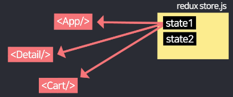

# Redux Toolkit: 간단한 전역 관리 tool

### 🧩Redux: props 없이 state를 공유할 수 있게 해준다



- 설치하게 되면 JS파일 하나에 state들을 보관하고, component들이 직접 뽑아서 쓸 수 있다
- 사이트가 규모가 커지면 props 넘기는 것이 매우 귀찮아지기 때문에 `redux`사용하는 것이 좋다

```
npm install @reduxjs/toolkit react-redux
```

- redux의 개선 버전인 `redux toolkit`을 설치한다. 이는 문법을 더 쉽게 사용할 수 있게 해준다
- `package.json`에서 react와 react-dom이 버전이 18.1 이상이면 사용 가능하다

store.js

```jsx
import { configureStore } from '@reduxjs/toolkit'

export default configureStore({
  reducer: { }
})
```

- store.js 파일을 만들어주고, 해당 형식을 그대로 넣어주는데 이곳에 state들을 보관하게 된다

index.js

```jsx
import { Provider } from "react-redux";
import store from './store.js'

const root = ReactDOM.createRoot(document.getElementById('root'));
root.render(
  <React.StrictMode>
    <Provider store={store}>
      <BrowserRouter>
        <App />
      </BrowserRouter>
    </Provider>
  </React.StrictMode>
);
```

- index.js 파일로 가서 store파일을 파일의 위치에 맞게 import해준다
- `<Provider store={store}>`로 <App />을 감싸주면 된다

### Redux 사용하여 state보관하기

store.js

```jsx
import { configureStore, createSlice } from '@reduxjs/toolkit'

let user = createSlice({
  name : 'user',
  initialState : 'kim'
})

export default configureStore({
  reducer: {
    user : user.reducer
  }
})
```

- `createSlice`로 state를 만들고, `configureStore`안에 등록하면 된다
- `createSlice`에서는 state의 이름과, state의 초기 값을 설정해줄 수 있다
- state의 등록은 `configureStore` 안에서 해준다. 등록 위해서는 reducer안에 `createSlice`를 통해 만든 `state명.reducer`로 등록해주면 된다
- configureStore는 규모가 커지고 middleware나 DevTools를 사용해야하는 경우에 사용하고, 보통 간단한 app의 경우에는 필수적이지 않다

Cart.js

```jsx
import { useSelector } from "react-redux"

function Cart(){
  let a = useSelector((state) => { return state } 
//let a = useSelector((state) => state.user )
  console.log(a)

  return (생략)
}
```

- `useSelector`를 import해오고, 값을 import해주면 해당 파일에 등록된 모든 state를 가져온다
- return과 중괄호를 생략하여 더 간단하게 표현할 수 있다
- state전부를 가져올 필요 없이, state에 user만 필요하다면 `return state.user`로 user state만 가져올 수 있다
- props를 쓰는 것은 작은 단위에서, Redux는 페이지 개수가 많아지는 경우에 사용하면 좋다

### Redux 상태 변경 함수 사용하기

store.js

```jsx
let user = createSlice({
  name : 'user',
  initialState : 'kim',
  reducers : {
    changeName(state){
      return 'john ' + state
    }
  }
})

//export 해주기
export let { changeName } = user.actions
```

- slice 안에 `reducers: { }` 안에 작명을 마음대로 하여 함수를 만들어준다
- 함수 안에 있는 전달 인자는 기존의 state가 된다
- 위의 함수는 결국 기존의 state의 앞부분에 john을 더한 state로 업데이트를 해준다
- 함수를 선언한 이후에는 export하는 과정이 필요하다
- export는 slice외부에서 해주는데, `export let { …}` 에서 `{…}`안에 작성한 함수를 넣어준다
- 우측 전달 인자로는 `slice명.actions`로 export해준다

Cart.js

```jsx
import { useDispatch, useSelector } from "react-redux"
import { changeName } from "./../store.js"

... 

<button onClick={()=>{
  dispatch(changeName())
}}>버튼</button>
```

- 사용하는 javascript 파일에서 먼저 `useDispatch`를 redux로 부터, 그리고 store.js 파일에서 앞서 export한 함수를 경로에 맞게 import 해준다
- import 한 이후에 `dispatch(함수명())`으로 함수를 호출해주면, `useState`에서 state를 변경하는 것처럼 state가 바뀌게 된다

### Array/object인 경우에 redux 변경

store.js

```jsx
let user = createSlice({
  name : 'user',
  initialState : {name : 'kim', age : 20},
  reducers : {
    changeName(state){
      return {name : 'park', age : 20}
    }
  }
})
```

- initial state로 {…} 같은 object 형식으로 선언해준다
- 만약 `changeName`이라는 함수가 호출되게 되면, 이전 state에서 {name : 'park', age : 20}으로 바뀌게 된다

```jsx
let user = createSlice({
  name : 'user',
  initialState : {name : 'kim', age : 20},
  reducers : {
    changeName(state){
      state.name = 'park'
    }
  }
})
```

- state를 직접 수정하는 것도 가능하다. 직접 수정하는 것이 더 좋기 때문에 직접 수정하자
- 이는 `Redux` 설치할때 같이 설치되는 `Immer.js` 라이브러리가 state 사본을 하나 더 생성해주기 때문이다
- 숫자 하나만 바꾸는 경우에도 state수정이 쉽기 때문에 object 자료형으로 사용하는 경우가 많다

### 전달 인자를 통해 상태를 업데이트

store.js

```jsx
let user = createSlice({
  name : 'user',
  initialState : {name : 'kim', age : 20},
  reducers : {
    increase(state, a){
      state.age += a.payload
    }
  }
})
```

- 함수의 첫 전달인자 `state`는 현재 state값이다
- 함수의 두번째 전달인자 `a`는, 함수를 호출한 코드에서 넣어주는 전달 인자 값이다. 뒤어 붙여주는 `payload`는 Redux 개발자가 화물처럼 전달해서 붙여준 것이다

Cart.js

```jsx
import {useDispatch, useSelector} from "react-redux"
import {changeName, increase} from "./../store.js"
...
function cart(){

const state = useSelector((state)=>state);
const dispatch = useDispatch();
...
<button onClick={()=>{
  dispatch(increase(10))
}}>버튼</button>
...
```

- 버튼을 클릭하는 경우에, `dispatch`로 호출하는  increase() 함수에서 전달 인자로 10을 넣어주면, 위의 store.js 코드에서 10이 action으로 들어가게 되고, 이 전달 받은 인자의 state를 업데이트 해줄 수 있다

### 파일 분할

- 코드가 너무 길어지면 관리하기 불편할 수 있기 때문에, slice 하나를 따로 코드로 빼서, export를 통해 파일을 따로 만들고, 그래로 기존 파일에서 import 경로를 수정해줄 수 있다

### 특정 버튼을 눌렀을때, Redux에 항목을 변경하기

Store.js

```jsx
let cart = createSlice({
  name : 'cart',
  initialState : [
    {id : 0, name : 'White and Black', count : 2},
    {id : 2, name : 'Grey Yordan', count : 1}
  ],
  reducers : {
    addCount(state, action){
      let num = state.findIndex((a)=>{ return a.id === action.payload })
      state[num].count++
    }
  }
}) 
```

Cart.js

```jsx
state.cart.map((a, i)=>
      <tr key={i}>
        <td>{state.cart[i].id}</td>
        <td>{state.cart[i].name}</td>
        <td>{state.cart[i].count}</td>
        <td>
          <button onClick={()=>{ dispatch(state.cart[i].id) }}>+</button>
        </td>
      </tr>
     )
   }
```

- `map`에서 i만으로 값을 Redux의 값을 변경시키는 경우에는, 배열의 순서가 정렬로 인해 바뀌는 경우에, 값을 증가시키고 싶은 index의 값을 변경시키지 못할 수 있기 때문에 distinct하게 구분되는 ID를 받아와서 특정 ID의 count를 증가시켜주면 된다
- dispatch를 import해와야 하고 Store.js에서는 함수를 export, Cart에서는 import해와야 한다

### 특정 버튼을 누르면 Redux에 항목을 추가하기

Store.js

```jsx
import { createSlice } from '@reduxjs/toolkit';

const cart = createSlice({
  name: 'cart',
  initialState: [
    { id: 0, name: 'White and Black', count: 2 },
    { id: 2, name: 'Grey Yordan', count: 1 },
  ],
  reducers: {
    addItem(state, action) {
      state.push(action.payload);
    },
    removeItem(state, action) {
      const itemIdToRemove = action.payload;
      return state.filter(item => item.id !== itemIdToRemove);
    },
  },
});

export const { addItem, removeItem } = cart.actions;
export default cart.reducer;
```

Cart.js

```jsx
 <button className="btn btn-danger" onClick={()=>{
    dispatch(addItem( {id : 1, name : 'Red Knit', count : 1} ))
  }}>주문하기</button>
 <button className="btn btn-danger" onClick={()=>{
    dispatch(removeItem(1))
  }}>삭제하기</button>
```

- 아이템을 추가하기 위해서는 추가할 아이템을 Redux로 넘겨주어야 한다
- 추가할 아이템을 dispatch를 통해 addItem함수를 불러와서 넣어주면, Redux에서는 넘겨받은 아이템을 push를 통해서 추가해준다
- 삭제할 아이템의 ID를 전달받으면 removeItem함수를 불러와서 ID값을 넘겨주고, Redux에서는 해당 ID를 가지는 아이템만 빼고 배열의 값을 업데이트 해준다
- 변경한 값은 새로고침 하거나 다시 컴파일 하면 초기 상태로 되돌아간다